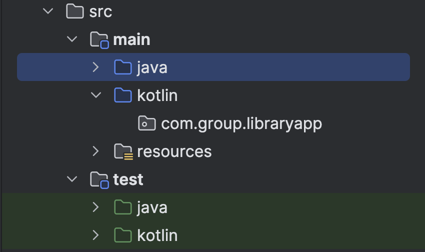

추가 공부 필요 항목

- Kotlin/Java Version 호환성 관계

## 1. 기존 Java 프로젝트 리팩토링 준비

### 1-1. Kotlin 코드 작성 준비

1. `build.gradle` 파일에 kotlin 설정 추가

    ```groovy
    plugins {
        // Kotlin 추가
        id 'org.jetbrains.kotlin.jvm' version '1.6.21'
    }
    
    dependencies {
        // Kotlin Standard Library 추가
        implementation 'org.jetbrains.kotlin:kotlin-stdlib-jdk8'
    }
    
    // Kotlin Compile Configuration
    compileKotlin {
        kotlinOptions {
            jvmTarget = "11"
        }
    }
    
    // Kotlin Test Compile Configuration
    compileTestKotlin {
        kotlinOptions {
            jvmTarget = "11"
        }
    }
    ```

2. 패키지 설정 (main/test 하위에 kotlin 패키지 추가)
   

